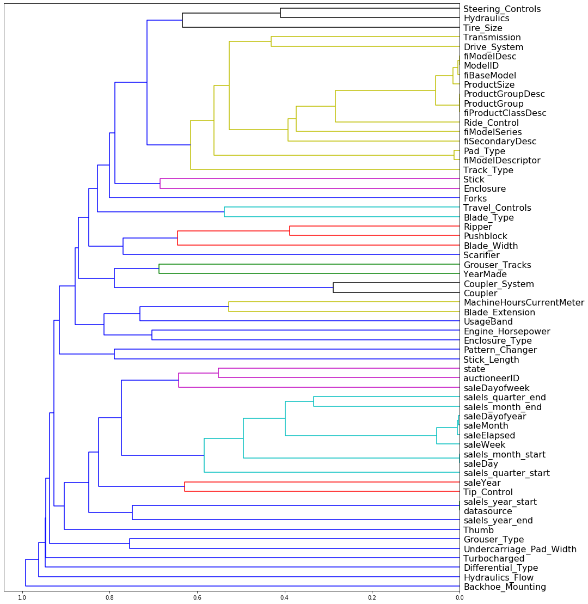
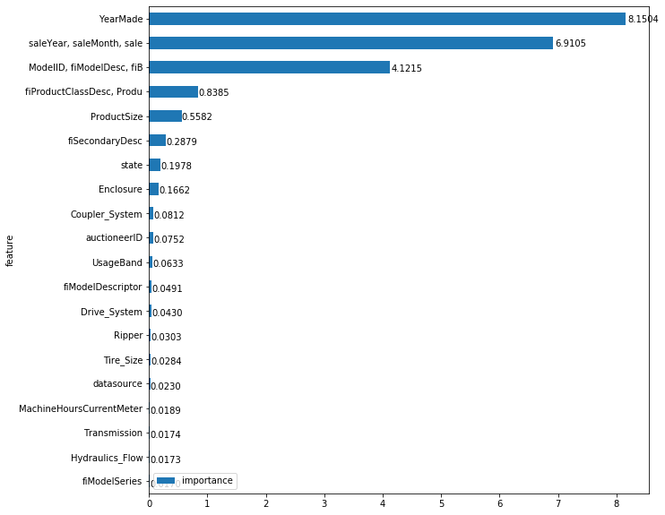
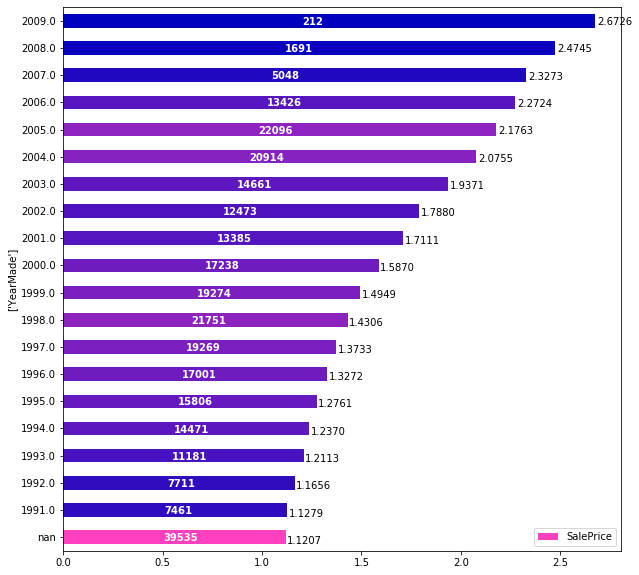
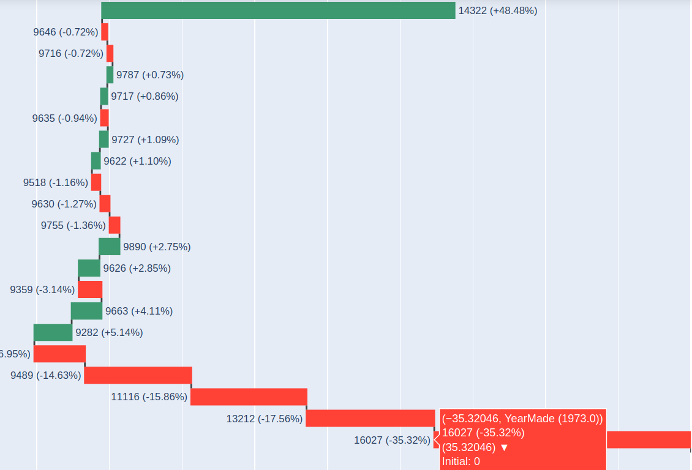
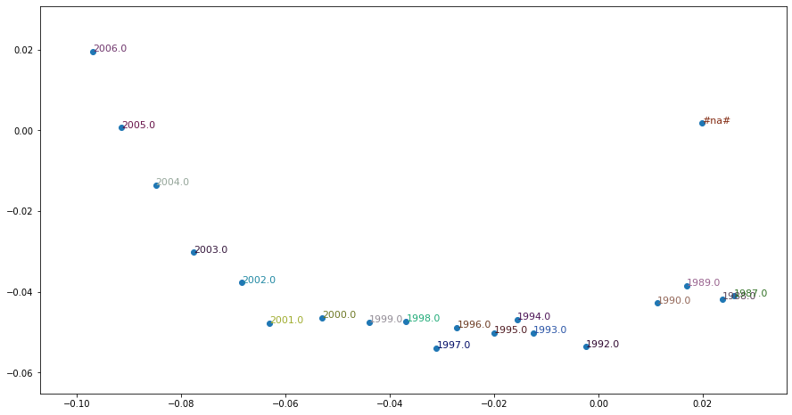

# fastai2-tabular-interpretation

This project helps you to interpret tabular models, made with [fastai2](https://github.com/fastai/fastai2)

Some examples of using these methods are made for 2 datasets: well known [Bulldozers dataset](https://www.kaggle.com/c/bluebook-for-bulldozers/data) and transfermarkt's [football players transfer statistics](https://www.kaggle.com/giovannibeli/european-football-transfers-database)

The following main interpretation methods are available:

- **Dendrogramm** -- can help to calculate and visualize features'  correlations which can be used later

- **Feature importance** -- can help to calculate relative  and visualize importance of isolated features as well as lists of correlated (connected) features, that were determined earlier

- **Partial Dependence** -- shows how particular value of a feature influence dependent variable. In what direction we should move this particular feature to minimase or maximize the result

- **Waterfall** help to visualize how tabular model came to concluzion in the particular case. How and in what direction each feature value moves the dependent variable

- **Embeddings** -- this chapter helps to visualize embeddings calculated im the model

Desision making algorythm
aknowlegments
Restrictions:
regression only

